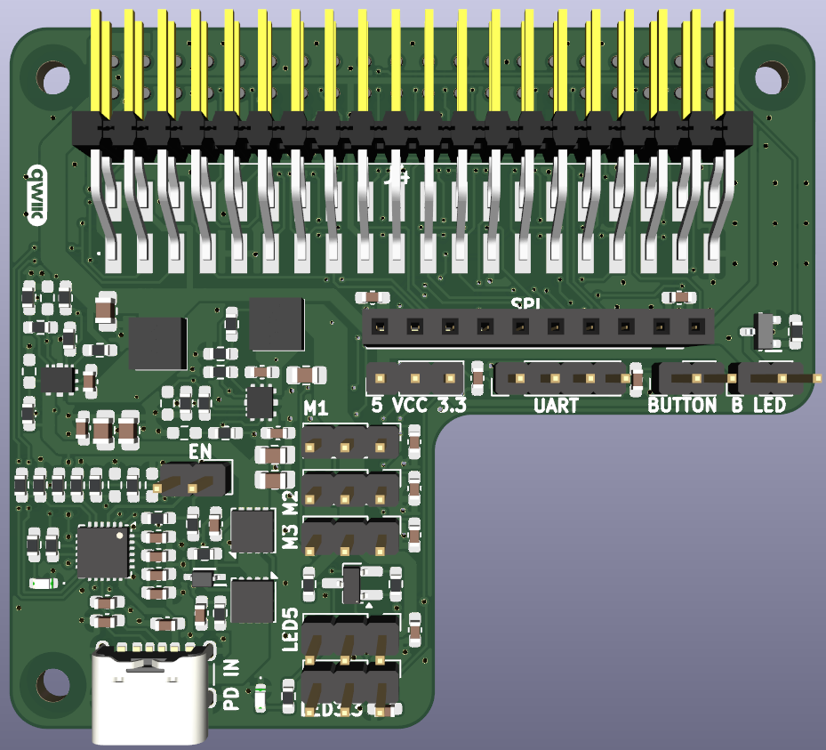

# torxHat

This repository contains the PCB design files for **torxHat** developed for the Robotic Study Companion (RSC) platform.

This board was designed to reduce dependency on specific audio HATs, while supporting multiple audio HAT options it also offers USB power delivery and peripheral connectivity.

---

## Design Summary
The PCB was designed in KiCad.

The board is powered from a single USB-C PD input configured for 20 V 2.5 A.

Power distribution is split into two independent 5.1 V rails:

* Logic rail for Raspberry Pi, audio hardware, and display
* High-current rail for servos and LED ring

The PCB is a compact two-layer Raspberry Pi HAT-compatible design with pass-through GPIO connectivity intended for audio HATs.

Audio HATs considered:

* AIY Voice Bonnet  
* ReSpeaker 2 Mics pHAT  
* WM8960 Audio HAT  
* AIY Voice HAT  
* Adafruit Voice Bonnet  
* Whisplay HAT  

---

## Author
Raiko Torga  
Supervised & reviewed by Matevž Borjan Zorec and Farnaz Baksh  
© Robotic Study Companion 2026
