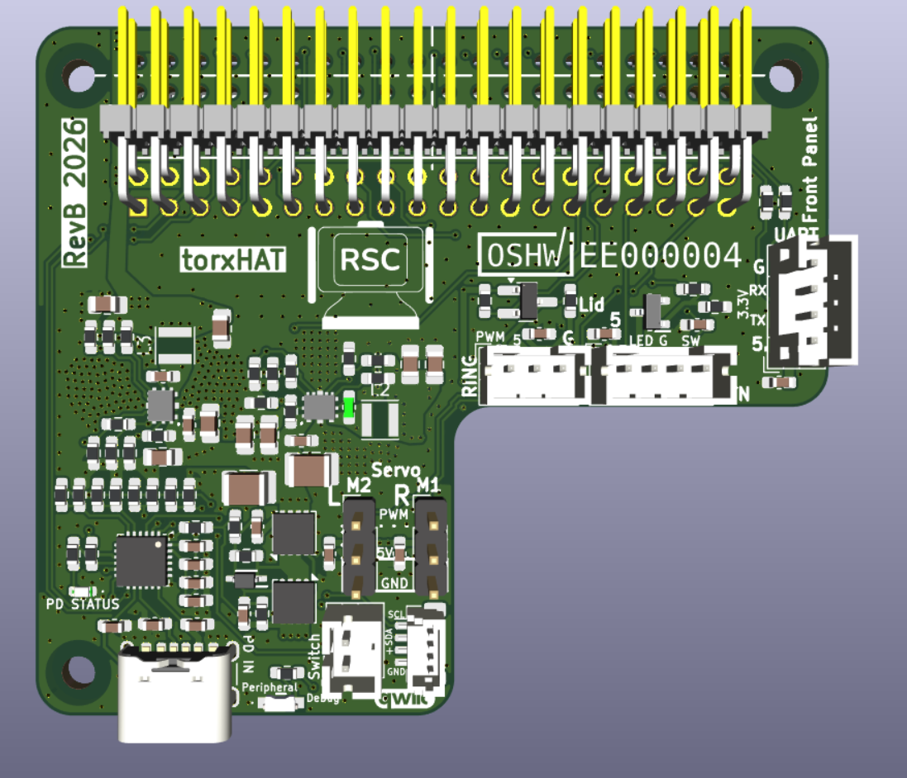

# torxHat

This repository contains the PCB design files for **torxHat**, designed in KiCAD, for the Robotic Study Companion (RSC; [rsc.ee](https://rsc.ee/)).
TorxHAT's design helps reduce dependency on any single specific Raspberry Pi audio HAT by supporting a wider variety. 
TorxHAT features USB Power Delivery and peripheral connectivity, including UART, multi channel PWM, I2C via Qwiic connector complete with a pass-through GPIO right-angle header.

Revision B Preview:

Pending validation testing; PCB in fabrication.

---

## Design Summary

A single USB-C PD input powers torxHAT, configured for 9V to 15V at up to 3A.
TorxHAT relies on two [LMR60440 3V to 36V, 4A, Synchronous, Buck Converters (link to datasheet)](https://www.ti.com/lit/ds/symlink/lmr60440.pdf?ts=1761834057549) powering two independent 5.1 V rails:

1. Logic rail: Raspberry Pi, audio hardware, and display
2. High-current rail for noisier peripherals: both servos, arcade button's LED plus an [Adafruit neopxLED ring (link to product page)](https://www.adafruit.com/product/2856)

TorxHAT's PCB packs a compact four-layer Raspberry Pi HAT-compatible design (though no EEPROM) with a complete pass-through GPIO connectivity intended for audio HATs.

We looked at the pinouts of following audio HATs when designing torxHAT:
* [Seeed Studios ReSpeaker 2-Mics pHAT v1.2(pinout link)](https://pinout.xyz/pinout/respeaker_2_mics_phat)
* [Waveshare WM8960 Audio HAT (product link)](https://www.waveshare.com/wm8960-audio-hat.htm)
* [Whisplay HAT(product link)](https://www.pisugar.com/products/whisplay-hat-for-pi-zero-2w-audio-display)
* [Adafruit Voice Bonnet (EOL; product link)](https://www.adafruit.com/product/4757)  
* [Google AIY Voice Bonnet v2 (EOL; pinout link)](https://pinout.xyz/pinout/aiy_voice_bonnet)
* [Google AIY Voice HAT v1 (EOL; pinout link)](https://pinout.xyz/pinout/voice_hat)

---

## Authors

* **RevA**: Raiko Torga
  * Original Bachelor's thesis artefact contribution. 
  * Supervisors: Matevž Borjan Zorec and Farnaz Baksh

* **RevB**: Raiko Torga, Matevž Borjan Zorec  

© Robot Study Companion 2026 
